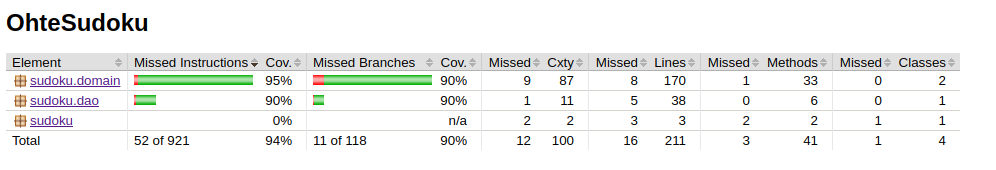

# Testausdokumentti

Ohjelmalle on kirjoitettu JUnit-testit, jotka testaavat sovelluslogiikan ja pysyväistallennuksen.

### Testikattavuus

Testikattavuus ilman käyttöliittymää on yhteensä 94% ja haarautuvuus 90%

