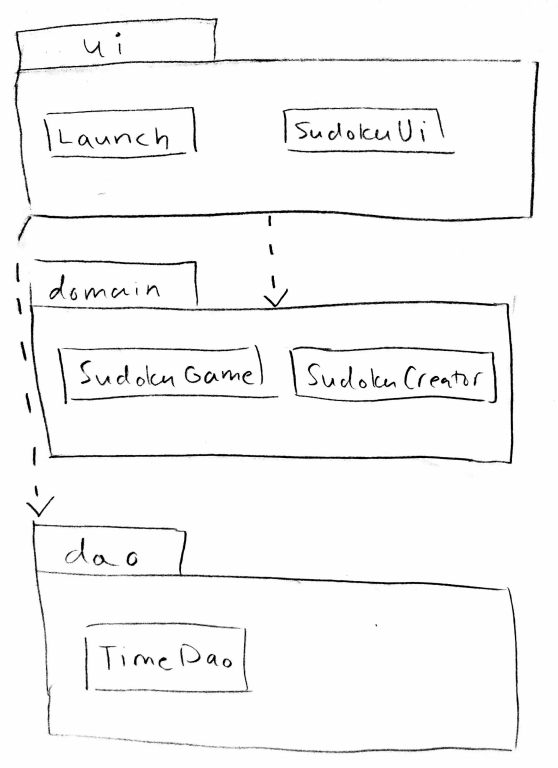
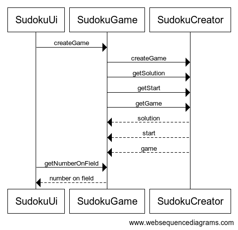
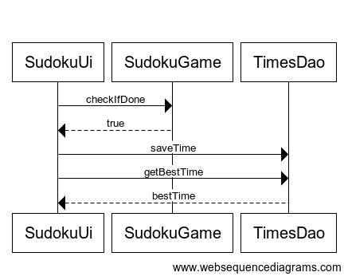

# Arkkitehtuurikuvaus

## Rakenne

sudoku-pakkaukseni sisäälä on kolme pakkausta: sudoku.ui, sudoku.domain ja sudoku.dao. sudoku-ui sisältää käyttöliittymän toteuttavat Launch ja SudokuUi, sudoku.domain sisältää sovelluslogiikan toteuttavat SudokuGame ja SudokuCreator. sudoku.dao sisältää tiedostoon tallentavan ja lukevan toiminnallisuuden toteuttavan TimeDao.

## Käyttöliittymä

Main sudoku.ui.Launch:issa käynnistetään käyttöliittymä, joka on toteutettu luokassa sudoku.ui.SudokuUi.

Käyttöliittymässä on neljä erillaista näkymää, jotka ovat toteutettu Scene-olioina.
- alkuvalikko
- vaihtuva pelinäkymä
- pelivalikko
- voitto

Käyttöliittymässä luodaan olio sudoku.domain.SudokuGame, jonka avulla kutsutaan tämän metodeja, ja olio sudoku.dao.TimeDao, jonka avulla kutsutaan tämän metodeja.

Käyttöliittymän kautta sovelluslogiikkaa kutsumalla pelaaja voi aloittaa uuden pelin, lisätä ja poistaa numeroita sudokupelistä. Lisäksi käyttöliittymässä voidaan liikkua valikosta pelinäkymään, pelistä pelivalikkoon, pelivalikosta käynnissä olevaan peliin tai uuteen peliin ja voittonäkymästä joko uuteen peliin tai valikkoon.

## Sovelluslogiikka

Sovelluslogiikka on toteutettu luokissa sudoku.domain.SudokuGame ja sudoku.domain.SudokuCreator. SudokuGame sisältää pelin hallinnoimisesta vastaavan koodin ja SudokuCreator vastaa pelin luomisesta. SudokuGame kutsuu SudokuCreatoria luomaan pelin ja käyttöliittymä kutsuu SudokuGamen metodeja.

SudokuGame kustuu SudokuCreatorin metodeja...
- createGame(), joka luo uuden ratkaisun ja pelin
- eri gettereitä

Käyttöliittymä kutsuu SudokuGamen metodeja...
- createGame(), kun valitaan uusi peli. SudokuGame kutsuu metodissa SudokuCreatorin createGame()-metodia pelin luomiseksi
- getNumberOnField(int row, int col), jonka avulla käyttöliittymä luo pelistä GridPane-ruudukon
- setSelectedField(int id), kun valitaan ruudukosta ruutu
- checkIfOriginalNumber(int row, int col), kun ruutuun yritetään lisätä tai siitä yritetään poistaa numeroa
- addToGame() ja checkIfDone(), kun ruutuun lisätään numero. addToGame()-metodia kutsutaan myös poistaessa numero pelistä
- eri gettereitä

## Pysyväistallennus

Pysyväistallennuksesta vastaa sudoku.dao.TimeDao, joka tallettaa tiedostoon "sudokuTimes" pelin pelaamiseen käytettyjä aikoja. 

Käyttöliittymä kutsuu metodea...
- saveTime(), joka tallettaa ajan tiedostoon
- getBestTime(), joka palauttaa parhaan ajan
- getTop(int), joka palauttaa halutun määrän parhaita aikoja listana

Ajat tallennetaan tiedostoon aika sekunteina jokainen omalla rivillään.

## Toiminnallisuuksia

### Pelin aloitus

Peli aloitetaan painamalla käyttöliittymän alkuvalikossa "Uusi peli". Tällöin käyttöliittymässä luodaan pelinäkymä ja luodaan peli seuraavasti:

SudokuCreator luo ensiksi oikean ratkaisun pelille (solution), jonka jälkeen se poistaa numeroita ratkaisusta, niin että peli on edelleen ratkaistavissa. Tällöin syntyy pelin alkutilanne (start) ja tämän hetkinen pelitilanne (game). Kaikki nämä palautetaan getterien avulla SudokuGamelle, joka tallentaa ne luokkamuuttujiinsa. Sitten SudokuGame palauttaa käyttöliittymälle alkutilanteen taulun (start) numerot, jotka lisätään peliruudukkoon pelinäkymään.

### Numeron lisääminen pelistä

Kun pelaaja haluaa lisätä numeron ruutuun, valitsee hän ensin käyttöliittymässä haluamansa ruudun ja numeron, kun muistiinpanot eivät ole päällä:

Ensiksi tarkistetaan, onko ruutu, jota yritetään valita alkutilanteessa pelin asettama ruutu. Mikäli on, ei sitä voi valita eikä ruutua muokata. Jos ruutu on pelaajan muokattavissa, asetetaan se valituksi ruuduksi SudokuGamen luokkamuuttujaan. Sitten pelaaja valitsee haluamansa numeropainikkeen, jota painaessa SudokuUi tarkistaa, onko muistiinpanopainike valittuna. Mikäli ei, asetetaan ruutuun valittu numero ja kutsutaan SudokuGamen addToGame()-metodia, joka lisää tämän hetkiseen pelitilanteeseen (game-muuttuja) kyseisen numeron. 

Numeron poisto toimii muuten samoin, mutta pelitilanteeseen lisätään numero 0 ja ruutuun laitetaan tyhjää.

### Pelin voittaminen

Peli voitetaan, kun pelaaja on asettanut kaikkiin tyhjiin ruutuihin oikean numeron, jolloin käyttöliittymässä luodaan voittonäkymä

Jokaisen numeron lisäämisen yhteydessä tarkistetaan, onko ruudukko täytetty kokonaan ja oikein kutsumalla SudokuGamen metodia checkIfDone(). Mikäli palautetaan true, käyttöliittymä tallettaa peliin kuluneen ajan kutsumalla TimeDaon metodia saveTime(). Tämä tallettaa ajan tiedostoon ja luokkamuuttujaan. Sitten haetaan vielä paras aika TimeDaon metodilla getBestTime() ja molemmat ajat näytetään voittonäkymässä.
