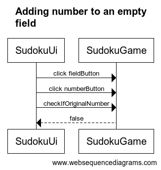

# Arkkitehtuurikuvaus

## Rakenne

sudoku-pakkaukseni sisäälä on kolme pakkausta: sudoku.ui, sudoku.domain ja sudoku.dao. sudoku-ui sisältää käyttöliittymän toteuttavat Launch ja SudokuUi, sudoku.domain sisältää sovelluslogiikan toteuttavat SudokuGame ja SudokuSolver. sudoku.dao on tällä hetkellä tyhjä, mutta tulee sisältämään pelaajan ennätysaikojen tallennuksen toteutuksen.

## Käyttöliittymä

Main sudoku.ui.Launch:issa käynnistetään käyttöliittymä, joka on toteutettu luokassa sudoku.ui.SudokuUi.

Käyttöliittymässä on neljä erillaista näkymää, jotka ovat toteutettu Scene-olioina.
- alkuvalikko
- vaihtuva pelinäkymä
- pelivalikko
- voitto

Käyttöliittymässä luodaan olio sudoku.domain.SudokuGame, jonka avulla kutsutaan tämän metodeja.

Käyttöliittymän kautta sovelluslogiikkaa kutsumalla pelaaja voi aloittaa uuden pelin, lisätä ja poistaa numeroita sudokupelistä. Lisäksi käyttöliittymässä voidaan liikkua valikosta pelinäkymään, pelistä pelivalikkoon, pelivalikosta käynnissä olevaan peliin tai uuteen peliin ja voittonäkymästä joko uuteen peliin tai valikkoon.

## Sovelluslogiikka

Sovelluslogiikka on toteutettu luokissa sudoku.domain.SudokuGame ja sudoku.domain.SudokuSolver. sudoku.domain.SudokuGame sisältää pelin luomisesta ja hallinnoimisesta vastaavan koodin. sudoku.domain.SudokuSolver tulee tulevaisuudessa toteuttamaan ratkottavan ja uniikin pelin luomista varten sudokun ratkojan. 

Pelin luomisesta vastaavia tärkeimpiä metodeja ovat muunmuaassa...
- createSolution()
- removeNumberFromSolution()
- createGame()
- getNumberOnField(int row, int col)

Käyttöliittymä kutsuu metodia createGame(), kun valitaan uusi peli, joka luo ratkaisun ja pelin sovelluslogiikassa. Käyttöliittymä saa pelin getNumberOnField(int row, int col)-metodin avulla luodessaan gridPane-ruudukkoa.

Pelin hallinnoimisesta vastaavia tärkeimpiä metodeja ovat muunmuaassa...
- setSelectedField(int id)
- addToGame()
- checkIfDone()

Käyttöliittymä kutsuu setSelectedField(int id)-metodia, kun valitaan ruudukosta ruutu. 

## Toiminnallisuuksia

