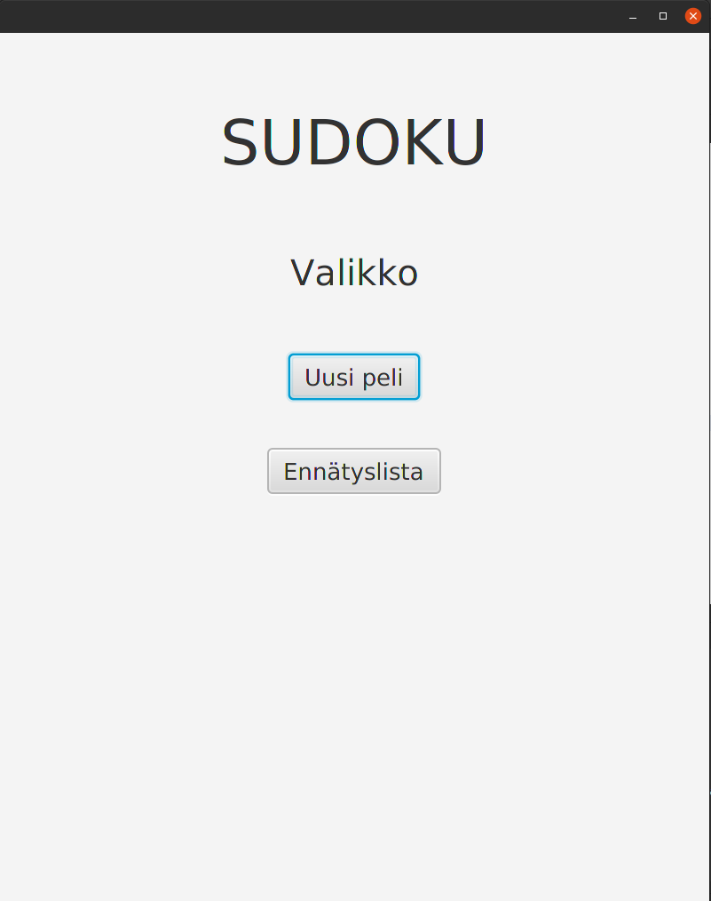
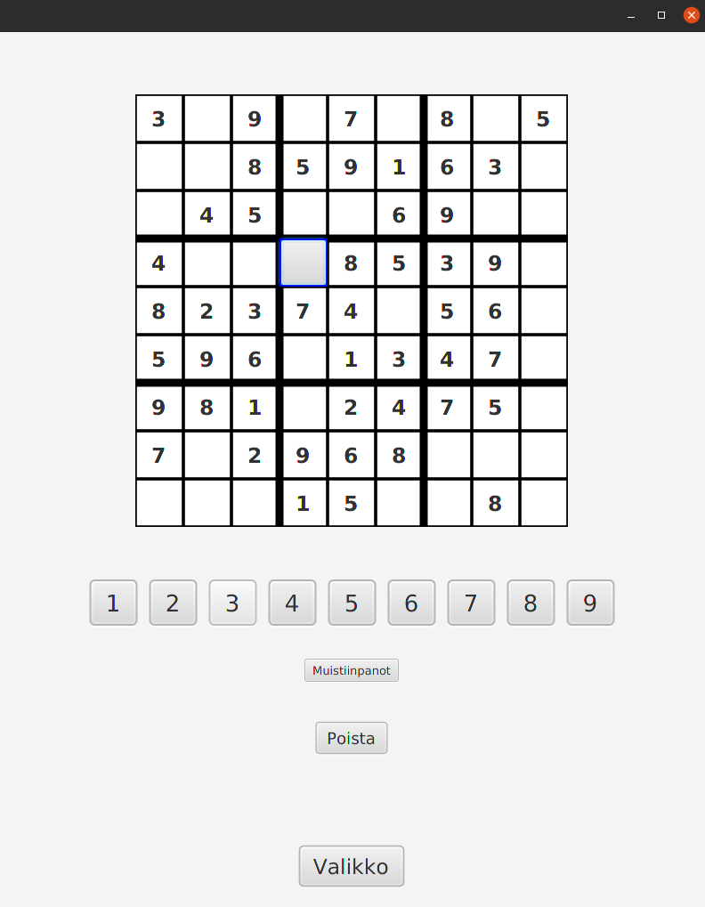
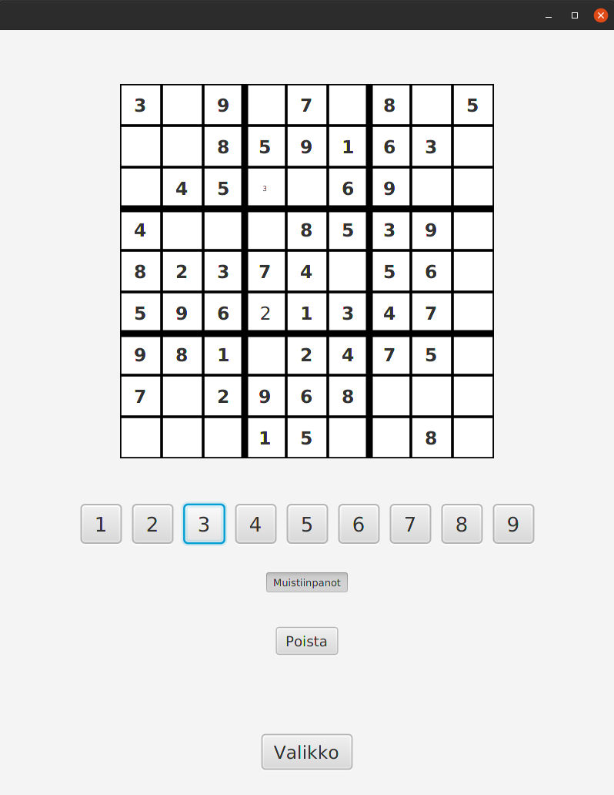
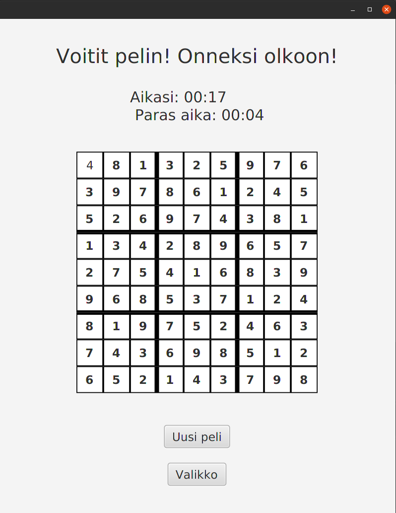

# Käyttöohje

Lataa ensiksi tiedosto 

### Ohjelman käynnistäminen 

Ohjelman voi käynnistää komennolla:

`java -jar OhteSudoku.jar`

### Pelin aloittaminen

Alkuvalikossa voi valita "Uusi peli", jolloin luodaan uusi peli ja siirrytään pelinäkymään.

### Ennätysten tarkastelu

Alkuvalikosta pääsee ennätyslistaan valitsemalla "Ennätyslista". Täältä näkee parhaat ajat, jossa peli on pelattu. Mikäli pelejä on pelattu vähintään 5 kertaa, sivulla nähdään maksimissaan viisi parasta aikaa.

### Pelaaminen

Pelinäkymässä voi valita haluamansa tyhjän ruudun klikkaamalla ruutua. Aluksi pelissä on vain pelin asettamat numerot, jotka ovat lihavoituja eikä niitä voi valita tai muokata. 
Mikäli ruudussa ei ole pelin asettamaa numeroa, pelaaja voi lisätä ruutuun tai poistaa ruudusta numeron tai muistiinpanon. 
Numero lisätään valitsemalla haluttu ruutu ja klikkaamalla sen jälkeen haluttua numeroa ruudukon alla olevista numeropainikkeista. Ruutuun voi lisätä numeron vaikka siinä olisikin jo pelaajan asettama numero. 
Muistiinpano voidaan lisätä painamalla ensin muistiinpanopainike pohjaan. Sitten valitaan haluttu ruutu ja numero edellä mainitulla tavalla. Kun taas halutaan vaihtaa pois muistiinpanotilasta, ja lisätä oikea numero, painetaan muistiinpanopainike takaisin ylös. Muistiinpanonumeroita voi poistaa numero kerrallaan valitsemalla ensin ruudun ja sitten ruudussa jo olevan muistiinpanonumeron.
Numeron tai muistiinpanot voi myös poistaa ruudusta valitsemalla ensiksi halutun ruudun ja painamalla sitten numerovalikon alla olevaa "Poista" -painiketta. Tämä tyhjentää kaikki ruudussa olevat muistiinpanot tai numeron, ja jättää ruudun tyhjäksi.

### Pelivalikko

Pelistä voi siirtyä valikkoon klikkaamalla pelinäkymän alalaidassa olevaa "Valikko" -painiketta. Valikosta voi joko palata takaisin samaan pelinäkymään valitsemalla "Jatka peliä" tai aloittaa uuden pelin "Uusi peli", jolloin edellinen peli häviää ja aukeaa uuden pelin pelinäkymä.

### Pelin voittaminen

Kun pelaaja on lisännyt kaikkiin ruutuihin oikean numeron aukeaa voittonäkymä, jossa pelaaja voi tarkastella täytettyä peliruudukkoa.
Näkymässä näkee myös peliin kulutetun ajan ja parhaan ajan, jossa sudokuja on suoritettu aikaisemmin.
Peliruudukon alapuolelta voi aloittaa suoraan uuden pelin valitsemalla "Uusi peli" tai siirtyä alkuvalikkoon painamalla "Valikko".

