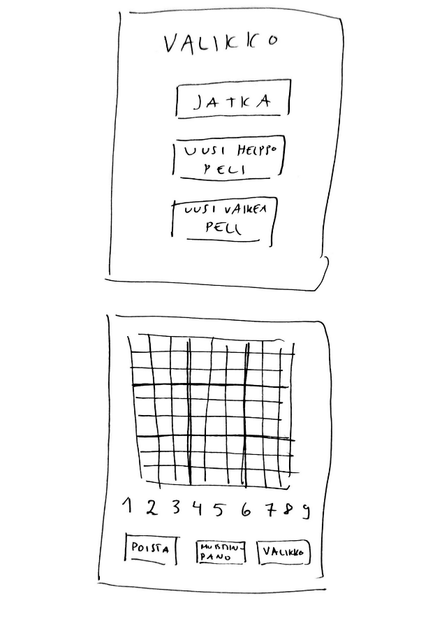

# Vaatimusmäärittely

## Sovelluksen tarkoitus

Sudoku-sovelluksessa voi pelata klassista sudoku-peliä, jossa pelaajan tulee täyttä 9x9 -ruudukko, niin että jokainen vaaka- ja pystyrivi sekä 3x3 -osaruudukko
sisältää yhden jokaista numeroa 1-9 välillä. Pelaaja voi valita vaikeusasteeksi helppo tai vaikea

## Käyttöliittymä

Sovellus koostuu valikosta ja itse pelistä. Kun sovelluksen käynnistää, aukeaa valikko. Pelinäkymään pääsee valitsemalla valikosta uuden helpon tai vanhan pelin. Mikäli pelistä siirtyy valikkoon kesken pelin, valikosta löytyy myös painike jatka peliä, josta pääsee takaisin pelinäkymään.

Valikon näkymässä painikkeet:
(-Jatka peliä) *jos peli on kesken*
-Uusi helppo peli
-Uusi vaikea peli

Pelinäkymässä:
-Peliruudukko, josta jokaisen ruudun voi valita
-Numerot 1-9, jotka voi valita täytettäväksi
-Valinta täytetäänkö ruutuja vai kirjoitetaanko muistiinpanoja
-Ruudun tyhjennys valinta
-Valikko-painike, josta siirrytään valikkoon

## Toiminnallisuus

- Pelaaja voi valita helpon tai vaikean pelin
