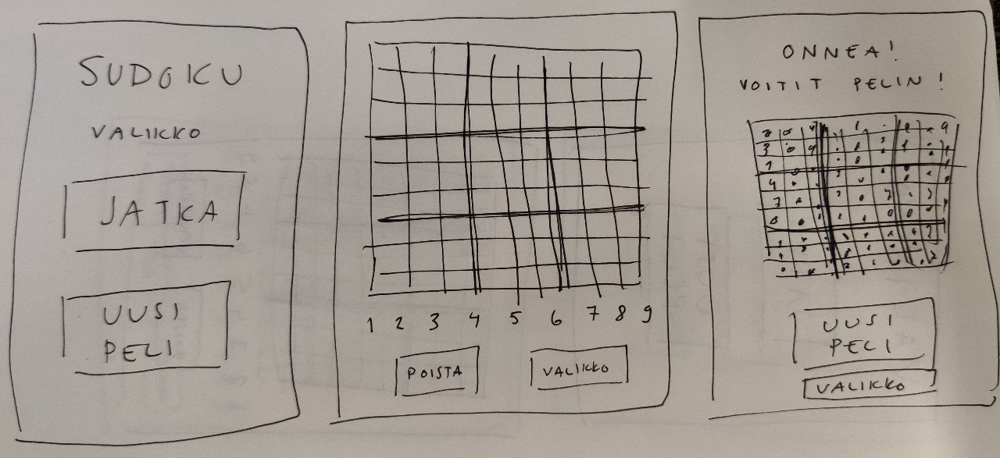

# Vaatimusmäärittely

## Sovelluksen tarkoitus

Sovelluksessani voi pelata klassista sudoku-peliä, jossa pelaajan tulee täyttä 9x9 -ruudukko, niin että jokainen vaaka- ja pystyrivi sekä 3x3 -osaruudukko
sisältää yhden jokaista numeroa 1-9 välillä. 

## Käyttöliittymä

Sovellus koostuu alkuvalikosta, ennätyslistasta, pelistä, pelivalikosta ja voittonäkymästä. Kun sovelluksen käynnistää, aukeaa alkuvalikko. 
Alkuvalikosta valitsemalla "Enntäyslista", pääsee ennätyslistanäkymään. 
Ennätyslistasta voi poistua alkuvalikkoon painamalla "Valikko".
Alkuvalikosta pääsee pelinäkymään painamalla "Uusi peli". 
Pelistä pääsee pelivalikkoon kesken pelin valitsemalla "Valikko". 
Pelivalikosta painamalla "Jatka peliä" pääsee takaisin samaan pelinäkymää, ja painamalla "Uusi peli" siirrytään uuden pelin pelinäkymään. 
Kun peliruudukko on täytetty onnistuneesti, siirrytään voittonäkymään, josta pääsee uuteen peliin ("Uusi peli") tai alkuvalikkoon ("Valikko").

#### Alkuvalikon näkymässä
- Otsikko: Sudoku
- Otsikko: Valikko
- Painike: Uusi peli
- Painike: Ennätyslista

#### Ennätyslista
- Ennätyslista, jossa max 5 parasta aikaa (jos pelattuna)
- Painike: Valikko

#### Pelinäkymässä
- Peliruudukko, josta jokaisen tyhjän ruudun voi valita
- 9 painiketta, joissa numerot 1-9
- Muistiinpanopainike: voi valita onko päällä / pois
- Painike: Poista
- Painike: Valikko

#### Pelivalikon näkymässä
- Painike: Jatka peliä
- Painike: Uusi peli

#### Voittonäkymä

- Onnitteluviesti
- Peliin kulunut aika
- Paras aika
- Valmis peliruudukko
- Painike: Uusi peli
- Painike: Valikko

## Toiminnallisuus

#### Sovelluksen avatessaan

- Voi valita aloittaa uuden pelin
   - Aukeaa uusi generoitu peli
- Voi siirtyä tarkastelemaan ennätyslistaa

#### Ennätyslistassa

- Näkee max 5 parasta aikaa
   - Mikäli pelejä ei ole koskaan pelattu, ennätyksiäkään ei ole
- Voi siirtyä takaisin alkuvalikkoon

#### Pelatessa

- Näkee peliruudukon
- Voi valita ruudun, johon voi... 
  - Lisätä numeron
  - Lisätä muistiinpanon
  - Poistaa yksittäisen muistiinpanonumeron
  - Poistaa numeron tai kaikki muistiinpanot ruudusta
- Siirtyä pelivalikkoon

#### Pelivalikossa

- Voi palata takaisin keskeneräiseen peliin
- Valita uuden pelin

#### Pelin loputtua

- Peli loppuu, kun kaikissa ruuduissa on oikea numero
. Voi verrata peliin tähän kulunutta aikaa parhaaseen aikaan
- Voi katsoa valmista ruudukkoa
- Aloittaa uuden pelin 
- Siirtyä alkuvalikkoon

## Jatkokehitysideoita

Perusversion jälkeen voidaan lisätä seuraavia toiminnallisuuksia:

- Kumoa viimeisin toiminto peliin
- Useampi vaikeusaste
- Kello näkyviin pelin aikana
- Asetukset, joissa voi...
  - Lisätä näkymään valitun ruudun pysty- ja vaakarivin korostamisen
