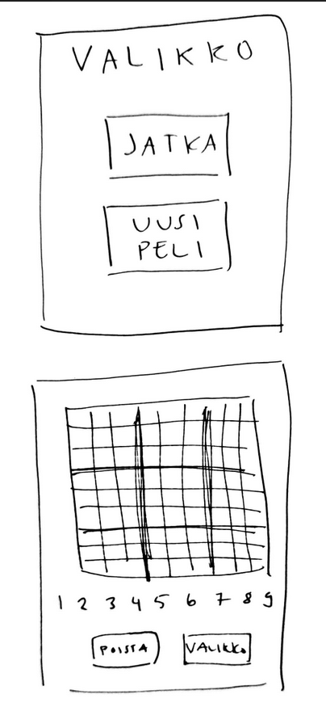

# Vaatimusmäärittely

## Sovelluksen tarkoitus

Sudoku-sovelluksessa voi pelata klassista sudoku-peliä, jossa pelaajan tulee täyttä 9x9 -ruudukko, niin että jokainen vaaka- ja pystyrivi sekä 3x3 -osaruudukko
sisältää yhden jokaista numeroa 1-9 välillä. Pelaaja voi valita vaikeusasteeksi helppo tai vaikea

## Käyttöliittymä

Sovellus koostuu valikosta ja itse pelistä. Kun sovelluksen käynnistää, aukeaa valikko. Pelinäkymään pääsee valitsemalla valikosta uuden helpon tai vanhan pelin. Mikäli pelistä siirtyy valikkoon kesken pelin, valikosta löytyy myös painike jatka peliä, josta pääsee takaisin pelinäkymään.

Valikon näkymässä painikkeet:
- (Jatka peliä) *jos peli on kesken*
- Uusi peli

Pelinäkymässä:
- Peliruudukko, josta jokaisen ruudun voi valita
- Numerot 1-9, jotka voi valita täytettäväksi
- Ruudun tyhjennys valinta
- Valikko-painike, josta siirrytään valikkoon

## Toiminnallisuus

### Sovelluksen avatessaan: 

- Voi valita helpon tai vaikean pelin

### Pelatessa:

- Näkee peliruudukon
- Voi valita ruudun, jonka jälkeen voi...
  - Lisätä ruutuun numeron
  - Lisätä ruutuun muistiinpanon, kun muistiinpano on valittuna
  - Poistaa ruudusta kaikki tieto eli numero tai muistiinpanot
- Siirtyä valikkoon

### Valikossa:

- Voi palata takaisin peliin
- Valita uuden helpon tai vaikean pelin

## Jatkokehitysideoita

Perusversion jälkeen voidaan lisätä seuraavia toiminnallisuuksia:

- Lisätä muistiinpanoja
- Lisätä vaikeusasteita
- Asetuksia, joissa voi...
  - Lisätä näkymään valitun ruudun pysty- ja vaakarivin korostamisen
  - Mahdollisuus vaihtaa yötilaan, jolloin tausta on tumma
